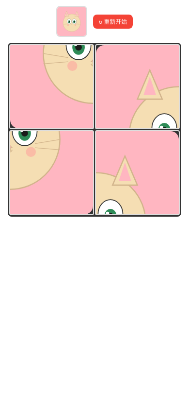

# 儿童拼图 🧩

一款专为 3-5 岁幼儿设计的拼图游戏，支持桌面和移动端，提供多种难度和图片选择。

在线体验：https://puzzle.aigame.art

## 截图预览

| 开始页 | 游戏页 |
|--------|--------|
|  |  |

## 功能

- **12 张手绘 SVG 预设图片** — 小猫、小狗、蝴蝶、向日葵等可爱图案
- **自定义上传** — 支持从相册选择图片，自动压缩至 800×800
- **3 种难度** — 2×2（4块）、3×3（9块）、4×4（16块）
- **多种交互方式** — 桌面拖拽、手机拖拽、点击交换
- **音效反馈** — 放对 Ding、放错 Boop、完成 Celebration（Web Audio API）
- **庆祝动画** — 拼图完成后显示鼓励语和用时
- **响应式设计** — 自适应桌面和手机屏幕

## 技术栈

- React 19 + TypeScript
- Vite（开发与构建）
- Vitest（单元测试，36 个测试）
- CSS（无第三方 UI 库）
- Web Audio API（音效生成）

## 项目结构

```
src/
  types.ts              # PuzzlePiece、GameState 等类型定义
  constants.ts          # 预设图片列表、难度选项、鼓励语
  utils/
    shuffle.ts          # Fisher-Yates 打乱算法（60% 位移保证）
    imageClip.ts        # 拼图块裁切区域计算
    imageCompress.ts    # 上传图片压缩
    sounds.ts           # Web Audio API 音效生成
  hooks/
    useGameState.ts     # 游戏状态管理（开始、交换、重置）
  components/
    StartScreen.tsx     # 开始页（图片选择 + 难度选择）
    GameScreen.tsx      # 游戏页（拼图网格 + 状态栏）
    CompleteScreen.tsx  # 完成页（庆祝 + 统计）
    PuzzlePiece.tsx     # 拼图块组件（拖拽 + 点击交换）
public/images/          # 12 个 SVG 预设图片
tests/                  # 9 个测试文件，36 个测试用例
```

## 快速开始

```bash
# 安装依赖
npm install

# 开发模式
npm run dev

# 运行测试
npm run test

# 构建生产版本
npm run build
```

## 游戏流程

1. **选择图片** — 从预设图片轮播中选择，或上传自己的图片
2. **选择难度** — 2×2 / 3×3 / 4×4
3. **开始拼图** — 拖拽或点击交换拼图块，还原原图
4. **完成庆祝** — 查看用时和鼓励语，可重新开始或换图

## 交互方式

| 方式 | 适用场景 | 操作 |
|------|----------|------|
| 桌面拖拽 | PC 浏览器 | 拖住拼图块放到目标位置 |
| 手机拖拽 | 触屏设备 | 手指按住滑动到目标位置 |
| 点击交换 | 所有设备 | 先点一块选中，再点另一块交换 |

## 部署

项目已部署到 Vercel，可通过以下方式部署：

1. 将代码推送到 GitHub
2. 在 Vercel 中导入项目
3. 自动构建部署

也可使用其他静态托管平台，构建产物在 `dist/` 目录。

## 开发历程

本项目使用 Claude Code + Superpowers 技能体系从 0 到 1 开发：

- **brainstorming** — 从一句"我想做儿童拼图游戏"出发，通过结构化提问和方案对比，形成完整设计
- **writing-plans** — 将设计转化为 15 个 TDD 任务级实施计划
- **subagent-driven-development** — 每个任务派遣独立子代理执行，完成后进行规格合规和代码质量两阶段审查

源码仓库：https://github.com/kensonhe/kids-puzzle

## License

MIT